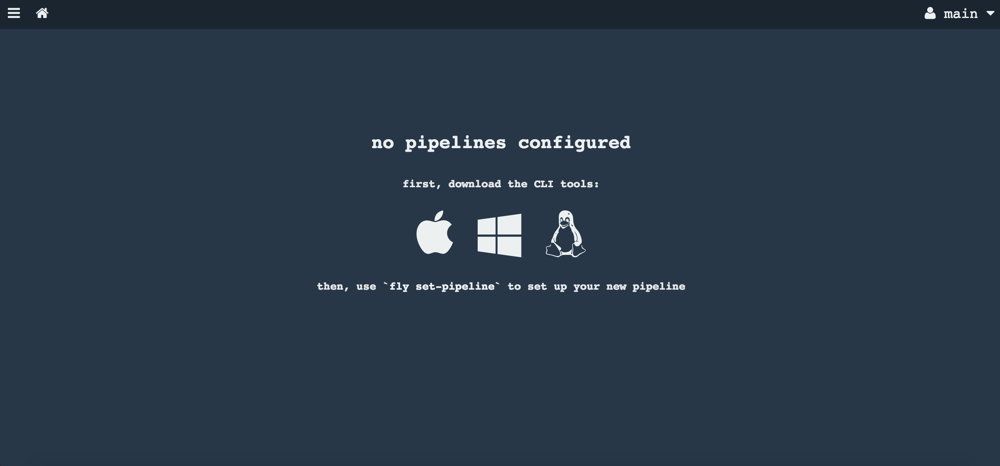

Concourse workshop
----

## Prerequisites
Minimum:
- Git account
- Concourse's team
- Attendee's must be authorized to access the concourse's team

Best:
- Docker installed
- Unix desktop (Cigwin)

## Workshop format
- There are no slides. This README.md has all the content of the workshop.
- Live coding following the agenda
- Concepts introduced thru out the workshop
- Attendees shall create everything from scratch. There is no sample project to start with.
- It is recommended that Attendees work in pairs and swap the keyword after they complete a lab/exercise.


## Agenda

1. [What is Concourse](#what-is-concourse)
  - Simple and scalable CI tool with usability in mind
  - Isolated builds
  - No snowflakes
  - No plugins but docker images and containers
  - Infrastructure agnostic (we can deploy it in AWS, vSphere, GCP, Azure, others)

2. [Getting ready to use Concourse](#get-ready)
  - How to get Concourse installed. We use will use bosh deployed Concourse
  - Users and Teams
  - Install fly

3. [Building basic pipeline to familiarize with pipeline concepts and Concourse itself (**fly** and Web UI)](basicPipeline.md)
  - Build simple pipeline incrementally
  - Pipeline as code
  - Concepts: Tasks, Jobs and Resources
  - Concourse UI + Fly command line

4. [Building a continuous integration pipeline](realPipeline.md)
  - Structure pipelines for reusability and other best practices (variables, credentials, templating)
  - Resources and versioning
  - Deploy to Cloud Foundry

5. [Improving our application pipeline](improvingPipeline.md)
  - Software workflows: Trunk and Feature-based development
  - Provision services

5. Pipeline Management
  - Bootstrapping: How do we create pipelines?
  - Monitoring and dashboards


# What is Concourse

- Continuous Integration Tool. You can check how Concourse compares with other CI tools here: http://concourse.ci/concourse-vs.html

- Simplistic architecture:
  * Command-line interface called **fly**
  * A Server component that runs the web UI and the API called from the command-line. The Web UI is only used for displaying the state of the pipelines and for triggering pipelines manually. All other tasks are performed via the fly CLI.
  * Worker machines where pipelines run


- Design Principles:
  - No snowflakes: there is no configuration of concourse server that we can apply on run-time, no gui, etc.
  - Usability in mind (with a single click you get what you need)
  - Isolated builds. There is no longer build pollution because everything runs in a container
  - Scalable. To add more capacity, we add more Worker machines.
  - No plugins but docker images. You bring your own docker image. You dont depend on pre-installed plugins.  
  - We dont need to backup concourse. Instead we should find a way to simply redeploy our pipelines again.
  - Infrastructure agnostic (we can deploy it in AWS, vSphere, GCP, Azure, others)


# <a name="get-ready"></a> Getting ready to use Concourse

## How to get Concourse installed

* We can install Concourse in our laptops using Vagrant or docker-compose.
  - [Local VM with Vagrant](http://concourse.ci/vagrant.html)
  - [Docker compose](http://concourse.ci/docker-repository.html) One sample docker-compose can be found [here](https://github.com/MarcialRosales/maven-concourse-pipeline/docker-compose.yml)
* Or we can use a Concourse server provisioned by your IT team


## Users and Teams

In Concourse, every pipeline belongs to a team. A team is a namespace for data  (to avoid name clash)  with its own authentication mechanism.

Importantly, a team does not have "users" added to and removed from it; it's only a configuration of auth methods.

For instance, one authentication method is basic authentication. If we create a team with that method, to access that team we need to provide one and only one username and password. The command below creates a team called `my-team` with a user `ci` and password `changeme`.

```
$ fly set-team -n my-team \
    --basic-auth-username ci \
    --basic-auth-password changeme
```

### main: the mysterious team
Out of the box, Concourse comes with a single team called `main`.

The main team is an admin team, meaning it can create and update other teams. Currently there is no way to promote a team to become an admin team, so main is a special-case.


## Install fly

During the introduction to Concourse we said that the Web UI is only used for displaying purposes. Instead we operate via a command-line tool, **fly**.

One quick way to install **fly** is to go to the concourse ui, login with your team, username and password. Once you are logged in you will find this screen that invites you to download the **fly** application.



Another way to install it is by download them from http://concourse.ci/downloads.html.

The first command we need to use is to `login`. This command associates an alias with our login credentials. Every command must be accompanied by this alias.
Check out the `help` command and discover the arguments we pass to the `login`:

```
fly login --help

fly [OPTIONS] login [login-OPTIONS]

Application Options:
 -t, --target=            Concourse target name
 -v, --version            Print the version of Fly and exit

Help Options:
 -h, --help               Show this help message

[login command options]
     -c, --concourse-url= Concourse URL to authenticate with
     -k, --insecure       Skip verification of the endpoint's SSL certificate
     -u, --username=      Username for basic auth
     -p, --password=      Password for basic auth
     -n, --team-name=     Team to authenticate with (default: main)
         --ca-cert=       Path to Concourse PEM-encoded CA certificate file.
```

Let's login now. I am going to use `local` as the target name but we can use any name we like:
```
fly -t local login -c http://myconcourse.com -n ourteam -u myuser -p mypassword
```

> During the login process, the *fly* command may inform us that we need to upgrade it because our client does not match the server's version.
Should that happened we only need to invoke the command: `fly -t mytarget sync`.

> **fly** save your target in ~/.flyrc
