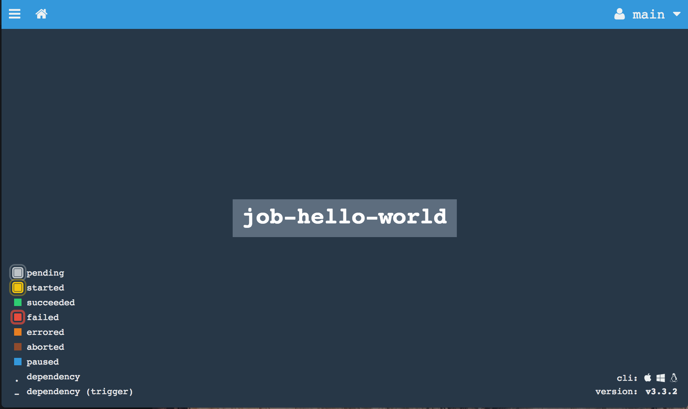
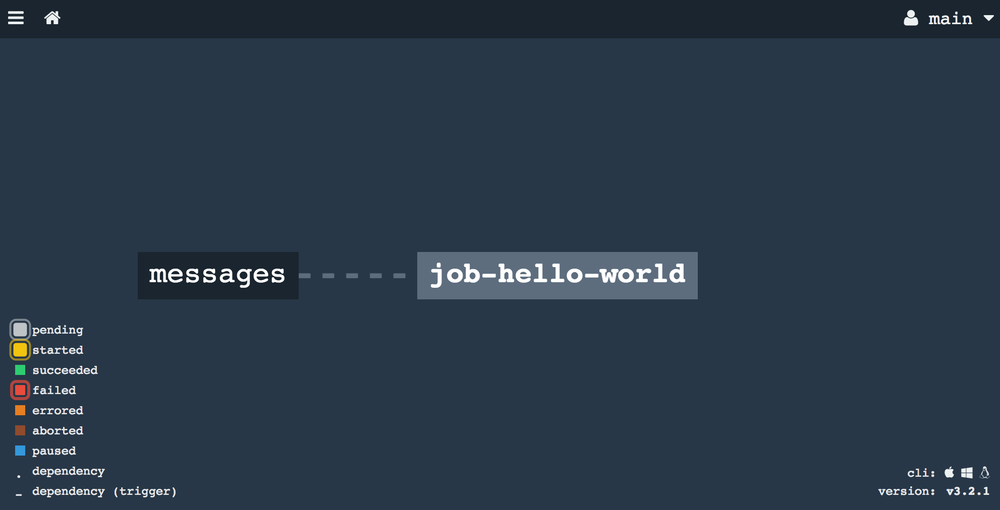
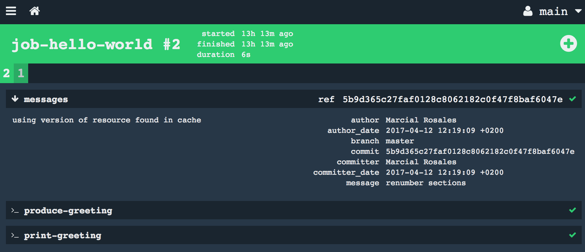

Concourse workshop
----


# Building basic pipeline to familiarize with pipeline concepts and Concourse itself (**fly** and Web UI)

We are going to build a pipeline step by step and on each step we introduce new concepts into the pipeline.

But what is a pipeline then?
  - A chain of actions or tasks where each task takes some input and produces an output. For instance in the diagram below, `Build` takes a `source` as input and produces a `jar` as output. That same `jar` becomes the input for `Deploy`.
    ```
        {source}----[ Build ]---{jar}---[ Deploy ]----
    ```
  - In Concourse, we define a pipeline in a plain YML file. No UI, no external configuration required in concourse. This is called **pipeline as code**.
  - We deploy the pipeline in Concourse by calling the appropriate commands in **fly**

Benefit of this approach:
  - Reproducible builds because configuration is on a file which should be versioned controlled (e.g. git) and Concourse has no state, workers are stateless.
  - Because there is no state in Concourse, no big deal if we loose Concourse. With Bosh we can have Concourse deployed in minutes. We only need to redeploy our pipelines.


Concourse is more than a CI tool. It is an automation tool that allows us to take any input (**resource**) and orchestrate the execution of scripts (**tasks**) which take input(s) and produce output(s) (another **resource**).

We will complete the pipeline in 7 separate labs:
- [Lab 1 - Print the hello world](#lab1)
- [Lab 2 - Produce a file with a greeting message](#lab2)
- [Lab 3 - Produce a file with a greeting message which must be configured thru a variable](#lab3)
- [Lab 4 - Refactor print-hello-world into produce-greeting and print-greeting](#lab4)
- [Lab 5 - Read part of the greeting message from a git repository](#lab5)
- [Lab 6 - Send greeting message to a slack channel and remove the `print-greeting` task](#lab6)
- [Lab 7 - Send a different greeting message to slack channel if the task `produce-greeting` failed](#lab7)

## <a name="lab1"></a> Lab 1 - Print the hello world

Lets start building a "hello world" pipeline to learn the pipeline mechanics and get familiar with Concourse UI too.

1. Create a folder. e.g. `mkdir hello-world-ci`
2. We create the following file `pipeline.yml` within the folder we just created:
  ```YAML
  jobs:
  - name: job-hello-world
    plan:
    - task: print-hello-world
      config:
        platform: linux
        image_resource:
          type: docker-image
          source: {repository: busybox}
        run:
          path: echo
          args:
          - "hello world"
  ```
3. Let's deploy the pipeline first.  
  `fly -t main sp -p hello-world -c pipeline.yml`

  `sp` is the alias of `set-pipeline`  
  `c` is the name of the pipeline file  
  `p` is the name we want to give to our pipeline  

4. Concourse will always print out the difference between what it exists in concourse and what we are deploying. Because this is a brand new pipeline all lines are in green color.

  ```YAML
  jobs:
    job job-hello-world has been added:
      name: job-hello-world
      plan:
      - task: print-hello-world
        config:
          platform: linux
          image_resource:
            type: docker-image
            source:
              repository: busybox
          run:
            path: echo
            args:
            - hello world
            dir: ""

  apply configuration? [yN]:
  ```
5. Lets visit Concourse UI.

  

  - Available pipelines
  - Pipeline's states: paused, running. We are in full control.
  - We can unpause it from the UI or from **fly**:  
    `fly -t main up -p hello-world`
  - Job's states

6. Triggering jobs
  - manually (via **fly** or thru UI) or automatic (via a resource)  
    `fly -t local tj hello-world/job-hello-world` to trigger a job
  - conditions that must be met before running a job:
    - it cannot be paused neither the pipeline
    - it has not exceeded the maximum concurrent jobs (http://concourse.ci/configuring-jobs.html#max_in_flight, http://concourse.ci/configuring-jobs.html#serial or http://concourse.ci/configuring-jobs.html#serial_groups)
  - Concourse runs each task in a separate container (in the docker image we specified in the task)
  - Monitor job execution thru UI or thru **fly**  
    `fly -t local builds` list all the jobs executed and being executed  
    `fly -t local watch -j hello-world/job-hello-world` tail the logs from the jobId. We obtain the jobId from the previous command.  


### Pipeline concepts

- A **pipeline** is a chain of jobs. Soon we will see what chains the jobs together. (See `jobs` in pipeline yml)
- **Jobs** describe the actual work a pipeline does. A Job consists of a build plan. (See `plan` )
- A **build plan** consists of multiple steps. For now, each step is a task. But we will see later that there are 2 more steps: *fetch* and *update resource steps*. These steps can be arranged to run in parallel or in sequence. (See array with just one element `task`)
- A **task** is a script executed within a container using a docker image that we specify in the pipeline. We can use any scripting language available in the docker's image, e.g. python, perl, bash, ruby. (see  `platform`, `image_resource`, and `run` attributes of a task)

## <a name="lab2"></a> Lab 2 - Produce a file with a greeting message

We continue with the previous pipeline but this time we are going to put more logic into the task. We are going to produce a file with a greeting and print out that file.

1. Produce a new pipeline file. In order to have more shell commands we need to pipeline all the commands to the shell.
  ```YAML
  ---
  jobs:
  - name: job-hello-world
    plan:
    - task: print-hello-world
      config:
        platform: linux
        image_resource:
          type: docker-image
          source:
            repository: busybox
        run:
          path: sh
          args:
            - -c
            - |
              echo "hello world" > greeting
              cat greeting

  ```

2. Deploy the new pipeline with a different name:
  `fly -t local sp -p greeting -c pipeline.yml`

## <a name="lab3"></a> Lab 3 - Produce a file with a greeting message which must be configured thru a variable

Eventually we need to customize the pipeline and to do that there is a concept of variables. **fly** does variable interpolation right before we set the pipeline. For more information, check out http://concourse.ci/fly-set-pipeline.html.

1. We are replacing the message "hello world" with a variable called `GRETTING_MSG`. To reference this variable from the pipeline we use this syntax  `((GRETTING_MSG))`. However, we need to use this variable from within a task and the way to variable to a task is via [parameters](http://concourse.ci/running-tasks.html#params).  

  ```YAML
  ---
  jobs:
  - name: job-hello-world
    plan:
    - task: print-hello-world
      config:
        platform: linux
        image_resource:
          type: docker-image
          source:
            repository: busybox
        params:
          MSG: ((GREETING_MSG))
        run:
          path: sh
          args:
            - -c
            - |
              echo "$MSG" > greeting
              cat greeting

  ```
2. We need to create a new file called `credentials.yml` (we can call it whatever we want) where we define the values for the variables we have referenced in the pipeline:
  ```YAML
  GREETINGS_MSG: hello world
  ```

3. We deploy our new pipeline. We need to specify the new `credentials.yml` file. It is possible to pass variables directly from the command line but that is cumbersome. See how Concourse displays the final pipeline with all the variables resolved.
  `fly -t local sp -p greeting -c pipeline.yml -l credentials.yml`

  - variable interpolation is quite simple, we cannot do string concatenation like this `((var1))-((var2))`. If we need that same value we need to create a new variable.
  - there is another way of doing variable interpolation that we will explorer in another lab.


## <a name="lab4"></a> Lab 4 - Refactor print-hello-world into produce-greeting and print-greeting

We learnt earlier that a job has a build plan which consists of multiple steps. We are going to introduce a second step/task to our job. Additionally, we are going to introduce the concept of artifacts. The first task will produce an output artifact and the second task will consume that output as an input artifact.

> For the advanced user: Artifacts most commonly come from Resources, e.g. a git resource. When Concourse clones the git repository, it produces an artifact which is then passed as input into a task.

1. Produce a new pipeline file. This time we have 2 tasks: `produce-greeting` and `print-greeting`. The first task produces an output artifact. An artifact maps to a folder or volume in container terms. The task `produce-greeting` has an output artifact called `greeting`. And that same artifact is passed as an input artifact to the next task `print-greeting`.
  ```YAML
  ---
  jobs:
  - name: job-hello-world
    plan:
    - task: produce-greeting
      config:
        platform: linux
        image_resource:
          type: docker-image
          source:
            repository: busybox
        outputs:
          - name: greetings
        run:
          path: sh
          args:
            - -c
            - |
              echo "hello world" > greeting
              cp greeting greetings

    - task: print-greeting
      config:
        platform: linux
        image_resource:
          type: docker-image
          source:
            repository: busybox
        inputs:
          - name: greetings
        run:
          path: sh
          args:
            - -c
            - |
              cat greetings/greeting

  ```

2. Tasks within a plan are executed sequentially and conditionally. If the first task fails, the job fails. Try to add the command `exit 2` at the end of the first task:
```YAML

        run:
          path: sh
          args:
            - -c
            - |
              echo "hello world" > greeting
              cp greeting greetings
              exit 2
```
3. If you deploy it and run it, it terminates on the first task. We will see later on how we can tell Concourse to run a bunch of tasks in parallel.

Note: When the job terminates, the artifacts we have generated within the job like the `greetings` one, are destroyed. They are simply volumes that Concourse mounts onto the containers but once the job terminates those volumes are destroyed. If we don't want to loose that data we need to put it somewhere, i.e. onto an output **resource**, e.g. to Nexus or Artifactory.  

## <a name="lab5"></a> Lab 5 - Read part of the greeting message from a git repository

The greeting message should consist of the `GREETING_MSG` variable followed by the first line of the README.md file from a github repo.

It is time to introduce **resources**, the other key element of a pipeline. Let's recap the pipeline concepts before we work on our next pipeline:

- **Resources** are inputs to a job (and ultimately tasks), and outputs from a job (and ultimately from a task) which are versioned (most of the time), specially if they are inputs.
- **Artifact** are input/output volumes. An input **resource** like a Git repo will have its own artifact where Concourse clones the repo.
- A **pipeline** is a chain of jobs which are linked each other via **resources**
- **Jobs** are a group of tasks that will automatically trigger when there is a new version of an input **resource**. If there is nothing new, there is nothing to do.


1. Produce a new pipeline file. We have introduced a new element to our pipeline, `resources` and in particular the resource of type `git` called `messages`. If you want to know more about what attribute we can specify for this resource go to https://github.com/concourse/git-resource. To know what other resources exist, check out http://concourse.ci/resource-types.html.

```YAML
---
resources:
- name: messages
  type: git
  source:
    uri: https://github.com/MarcialRosales/maven-concourse-pipeline

jobs:
- name: job-hello-world
  plan:
  - get: messages
  - task: produce-greeting
    config:
      platform: linux
      image_resource:
        type: docker-image
        source:
          repository: busybox
      inputs:
        - name: messages
      outputs:
        - name: greetings
      run:
        path: sh
        args:
          - -c
          - |
            MSG=`head -1 messages/README.md`
            echo "hello $MSG !!!" > greeting
            cp greeting greetings

  removed the 2nd job for brevity             
```

2. Deploy the pipeline
  `fly -t local sp -p hello-world4 -c pipeline.yml`

  

  - A resource is implemented as a docker image with 3 scripts: check, in, and out. If this is only an input resource, the **check** script  returns the latest version available in that resource. The **in** script produces zero or many files in a folder named after the resource's name. The **out** script takes files from a folder and send them to some target location, e.g. a mail server, a slack server, nexus, etc.
  - Resources are always rendered with black background cross
  - Check the status of the resource: running (version), paused, and failed.
  - Jobs can be manually trigger.
  - But they can also be automatically triggered when there is a new version of a resource
  - Resources linked to a job with a dashed-line means that a new version of the resource will not trigger the job
  - Resources linked to a job with a bold-line means that a new version will trigger the job
  - Concourse shows for each build, each resource and the version that was used in that build.


3. And run it

  

  - A job fetches the latest version (by default it is the latest) available in the resource
  - Concourse UI shows for each job's build, the fetched resources (with a south pointing arrow), the tasks invoked (with `>_` symbol) and the put resources (none for now in our pipeline). Each fetched resource has its version. And for git resources, it shows very useful information such as branch, committer, date and the commit message.  


4. Modify the pipeline so that it triggers when there is a new version of the github repo. For hints: http://concourse.ci/get-step.html#trigger

  Did it run automatically right after you set the pipeline?

5. Commit a change and push it to your repo so that Concourse detects it.


## <a name="lab6"></a> Lab 6 - Send greeting message to a slack channel and remove the `print-greeting` task

In the previous lab, we added the **git** **resource** we see below. We used it as an input resource.
  ```YAML
  resources:
  - name: messages
    type: git
    source:
      uri: https://github.com/MarcialRosales/maven-concourse-pipeline

  ```
In this lab, we are going to use another resource but this time it is an only output resource. Concourse comes with a number of [resources types](https://concourse.ci/resource-types.html) installed out of the box. But we can add new resource types. We are going to add one for [slack notifications](https://github.com/cloudfoundry-community/slack-notification-resource).

Let's go step by step:

1. Go to https://my.slack.com/services/new/incoming-webhook/
2. Select your private channel
3. Slack produces a webhook url usually in the form: https://hooks.slack.com/services/XXXX
4. Modify the pipeline we have been working on and add these lines at the beginning. We are telling Concourse that we want to declare a new resource type. To do so, we give it a name and the docker image that implements it.

  ```YAML
  resource_types:
  - name: slack-notification
    type: docker-image
    source:
      repository: cfcommunity/slack-notification-resource
      tag: latest
  ```

  > Where is Concourse downloading those images from? By default, it uses docker hub. However we can specify our own docker registry.

5. We need to add a new resource for the slack notification. We configure the resource to point to our webhook url.
  ```YAML
  - name: slack-greeeting
    type: slack-notification
    source:
      url: https://hooks.slack.com/services/XXXXX
  ```
6. And we use the slack notification resource that we called it `slack-greeting` to send a notification. To do so, we use the `put` step.

  ```YAML
  - put: slack-greeeting
    params:
      text_file: greetings/greeting
      text: |
        The job-hello-world had a result. Check it out at: $ATC_EXTERNAL_URL/builds/$BUILD_ID
        Result was: $TEXT_FILE_CONTENT
  ```
  > When we use a `get` or `put` step, Concourse provides certain metadata via environment variables. http://concourse.ci/implementing-resources.html#resource-metadata

We know that Concourse executes a build plan step by step. If the task `print-greeting` failed (try it out by adding `exit 2` command), it would skip the last step, the `put` step.

## <a name="lab7"></a> Lab 7 - Send a different greeting message to slack channel if the task `produce-greeting` failed

We can tag every step in a build plan with a callback step. The callbacks are `on_success`, `on_failure`, `ensure`.

1. Send a different slack message when the task fails.

```YAML
jobs:
- name: job-hello-world
  plan:
  - get: messages
    trigger: true
  - task: produce-greeting
    on_failure:
      put: slack-greeeting
      params:
        text_file: greetings/greeting
        text: |
          The task print-greeting has failed. Check it out at: $ATC_EXTERNAL_URL/builds/$BUILD_ID
          Result was: $TEXT_FILE_CONTENT
    config:

  rest removed for brevity
```
