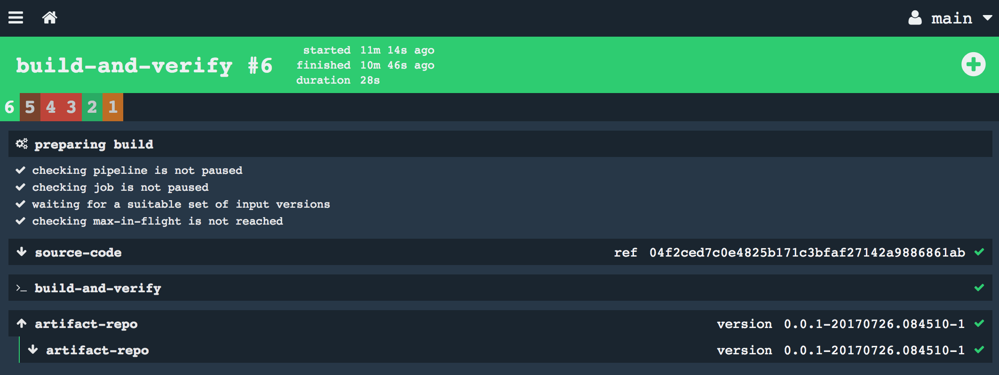

Concourse workshop
----


# Building a continuous integration pipeline for Java applications

It is time to move on and do more practical things: Build a CI pipeline for Java applications.

## Organizing pipelines

We are going to create our application pipeline attending the following best practices:
- Pipeline and variable files (`--load-vars-from`) must be versioned controlled
- Sensitive data (like passwords and private keys) stored in variable files should never be versioned controlled (or at least in clear)
- Pipelines and variable files should be stored along with the application (or microservice) we are building
- We should not reinvent the wheel on each application. We should build pipelines in such a way that we can use them to build any application
- We are aiming for consistent builds. Lock down pipeline and resource type's versions too
- Tasks should be defined in "Task Definition" files rather than inline in the pipeline
- Suggested structure:
  ```
  <pipelineRepo>
    └── ci        <---  contains pipeline definition files
          └── application/pipeline.yml  <-- contains pipeline that builds applications
          └── images/pipeline.yml       <-- contains pipeline that builds docker images
          └── deployment/pipeline.yml   <-- contains pipeline that deploys applications
    └── tasks     <--- contains task definition files. Each task has 2 files: the definition and the script
          └── build.yml
          └── build.sh
          ...
    └── docker    <--- contains Dockerfile(s) for images used by the pipelines
          └── maven/Dockerfile
          └── dotnet/Dockerfile
  ```

## Set up repository for our application

We will start with just one repository for our application and pipeline. We can move the pipeline to another repo later on.

1. Create our Spring boot application `app1`. If you dont have curl you can use Postman or directly go to https://start.spring.io.
  ```
  curl https://start.spring.io/starter.tgz -d dependencies=web,actuator -d baseDir=app1 | tar -xzvf -
  cd app1
  git init
  ```
2. Create remote repo, e.g. git@github.com:MarcialRosales/app1.git and our project with this remote repo
  ```
  git remote add origin git@github.com:MarcialRosales/app1.git
  ```

3. Add the corresponding folders for the pipeline Infrastructure
  ```
  mkdir  -p ci/application
  mkdir -p tasks
  ```

We will complete the pipeline in 7 separate labs:
- [Lab 1 - Build maven project and run unit tests](#lab1)
- [Lab 2 - Tasks should be defined in "Task Definition" files rather than inline in the pipeline](#lab2)
- [Lab 3 - Publish application artifact (jar) to a central repository](#lab3)
- [Lab 4 - Deploy application to PCF](#lab4)
- [Lab 5 - Externalize credentials](#lab5)

## <a name="lab1"></a> Lab 1 - Build maven project and run unit tests

1. Create an empty pipeline file `ci/appication/pipeline.yml`

  ```YAML
  ---
  resources:

  jobs:

  ```
2. Declare the resource for our application's git repo.

  ```YAML
  resources:
  - name: source-code
    type: git
    source:
      uri: https://github.com/MarcialRosales/app1
      branch: master
  ```

3. Declare the build job

  ```YAML
  - name: build-and-verify
    plan:
    - get: source-code
      trigger: true
    - task: build-and-verify
      config:
        platform: linux
        image_resource:
          type: docker-image
          source:
            repository: busybox
        inputs:
          - name: source-code
        run:
          path: sh
          args:
            - -c
            - |
              echo "Calling Maven ..."
              cd source-code
              mvn verify

  ```

  Before we can actually run it we need to push the code.
  ```
  git add pom.xml src
  git commit -m "Add application source code"
  git add ci
  git commit -m "Add first pipeline"
  git push -u origin master
  ```

  Now, we can run the pipeline:
  `fly -t local sp -p app1 -c ci/application/pipeline.yml`

  It should fail with the error:
  ```
  using version of resource found in cache
  Calling Maven ...
  sh: mvn: not found
  ```

  It failed because the `busybox` image does not know anything about Maven, neither about Java.

4. Use a specialized docker image to build maven projects
  - We need to search in docker hub to find a maven docker image that suits us. I found https://hub.docker.com/_/maven/.
  - If we don't specify a tag (or version), Concourse will use `latest`. However, if we want to have reproducible builds we definitely need to specify the version we want, e.g. 3.3.9-jdk-8.

  Let's try that :
  ```YAML
  - name: build-and-verify
    plan:
    - get: source-code
      trigger: true
    - task: build-and-verify
      config:
        platform: linux
        image_resource:
          type: docker-image
          source:
            repository: maven
            tag: 3.3.9-jdk-8
        inputs:
          - name: source-code
        run:
          path: sh
          args:
            - -c
            - |
              echo "Calling Maven ..."
              cd source-code
              mvn verify

  ```

  After we set the pipeline changes, the pipeline does not automatically trigger. It did trigger when we first run it but the only automatic trigger is the resource which has not changed its version yet. Hence there is nothing to build.

  We have to manually trigger it.
  `fly -t local tj -j app1/build-and-verify --watch`

5. So far we have managed to build our maven project.

## <a name="lab2"></a> Lab 2 - Tasks should be defined in "Task Definition" files rather than inline in the pipeline

So far we have worked on a single file, the `pipeline.yml`. On this file we have defined **inline** the task configuration, a.k.a. *task definition*. However that is far from ideal for various reasons:
  - pipeline becomes difficult to read and maintain
  - we cannot reuse the tasks without copying and pasting it
  - we cannot test tasks in isolation

> Best practice : In general, try and think in terms of small reusable tasks that perform a simple action with the inputs that they're given. If a task ends up having too many inputs then it may be a smell that your task is doing too much. Similar to if a function in a program you were writing had a lot of parameters. In fact, that's a good way to think about tasks: they're functions that take inputs as parameters. Keeping them small and simple allows you to easily run them from your local machine.


1. Refactor task into a new file called `tasks/build.yml`
  ```YAML
  platform: linux
  image_resource:
    type: docker-image
    source:
      repository: maven
      tag: 3.3.9-jdk-8
  inputs:
    - name: source-code
  run:
    path: sh
    args:
      - -c
      - |
        echo "Calling Maven ..."
        cd source-code
        mvn verify
  ```
2. It is a good practice to separate the script of the task from the task definition.

  *tasks/build.yml*
  ```YAML
  platform: linux
  image_resource:
    type: docker-image
    source:
      repository: maven
      tag: 3.3.9-jdk-8
  inputs:
    - name: source-code
  run:
    path: source-code/tasks/build.sh
  ```

  *tasks/build.sh*
  ```sh
  #!/bin/sh

  set -eu
  echo "Calling Maven ..."
  mvn verify
  ```

  > Remember to give execution permissions to the scripts otherwise Concourse will fail to execute them
  > unix: chmod a+x tasks/build.sh
  > windows: git update-index --chmod=+x tasks/build.sh

3. We can run run this task on its own. It will be run in Concourse so the execution semantics are the same.

  We need to pass the input and output folders we want to use to execute the task.
  `fly -t local execute -c tasks/build.yml -i source-code=. `

  We can monitor this task thru `fly -t local builds`. Concourse assigns it `one-off` as the pipeline/job.

4. Once we have the task ready, we can refer to it from the pipeline:
  ```YAML
  ---

  resources:
  - name: source-code
    type: git
    source:
      uri: https://github.com/MarcialRosales/app1
      branch: master

  jobs:
  - name: build-and-verify
    plan:
    - get: source-code
      trigger: true
    - task: build-and-verify
      file: source-code/tasks/build.yml

  ```

5. Push the tasks to the git repository before updating the pipeline in Concourse
  ```
  git add tasks
  git add ci/application/pipeline.yml
  git commit -m "Refactor build.yml task from application pipeline"
  git push

  fly -t local sp -p pipeline -c ci/application/pipeline.yml
  ```

**Things to know about tasks definitions and pipelines**:
- The input and output resource names used in the task definition file (e.g. `build.yml`) has to match the name of the fetched resources in the pipeline.
- When the name chose for the task's resources does not match the resource names in the pipeline we can map them. In the example, the input resource is `application` however `build.yml` expects `source-code` as the input resource.
  ```YAML

  - get: application
    trigger: true
  - task: build-and-verify
    file: source-code/tasks/build.yml
    input_mapping: {source-code: application}

  ```

## <a name="lab3"></a> Lab 3 - Publish application artifact (jar) to a central repository

There are two ways of producing an output or outcome in Concourse:
  - One way is to use a Concourse Resource making Concourse aware that we have produced an output (potentially versioned)
  - Or directly within a task, e.g. `scp ....` or `mvn deploy`. In a nutshell, Concourse is not aware that we have produced an output

The key concept of a pipeline is that jobs are chained together thru resources. And another way of putting it is that resources flow thru jobs. e.g. jobA produces ResourceA and jobB depends on ResourceA. When there is a new version of ResourceA, jobB triggers and uses the exact version it detected in ResourceA.

If we want to leverage this pipeline mechanism we have to publish the application's artifact using a resource not directly from a task. We are going to use Nexus 2 Repository Manager and there is a concourse resource for that [maven-resource](https://github.com/Pivotal-Field-Engineering/maven-resource). If we were to deploy to Artifactory we would have used [artifactory-resource](https://github.com/pivotalservices/artifactory-resource). But it turns out this resource does not work well for Nexus.

1. Add a new resource type to our pipeline:

  ```YAML
  resource_types:
  - name: maven-resource
    type: docker-image
    source:
      repository: pivotalpa/maven-resource
      tag: latest
  ```

  > We probably want to lock down the version of the resource

2. Add new resource:

  ```YAML
  - name: artifact-repo
    type: maven-resource
    source:
      url: http://192.168.1.36:8081/nexus/content/repositories/snapshots
      artifact: com.example:demo:jar
      username: admin
      password: admin123
  ```

3. Declare an output on the `build.yml` task

  ```YAML
  outputs:
    - name: build-artifact

  ```

4. Copy the built jar to the output folder (within `build.sh`)

  ```sh
  ....

  echo "Copying artifacts ..."
  cp -r target/*.jar ../build-artifact

  ```

5. Put built jar into Nexus. At the minimum, we need to specify the actual file (we can use regular expression) and `pom.xml` file

  ```YAML
  ....

  - task: build-and-verify
    file: source-code/tasks/build.yml
  - put: artifact-repo
    params:
      file: build-artifact/*.jar
      pom_file: source-code/pom.xml

  ```

6. Commit the changes
  ```sh

  git add tasks/build.sh tasks/build.yml
  git commit -m "Copy jar to an output folder"
  git add ci/application/pipeline.yml
  git commit -m "Put built jar into nexus resource"
  git push

  ```
7. Update pipeline

  `cf -t local sp -p pipeline -c ci/application/pipeline.yml`

8. The pipeline triggers automatically.

  The job took version `04f2ced7c0e4825b171c3bfaf27142a9886861ab` from `source-code` and produced version `0.0.1-20170726.084510-1`.
  

  Nexus has the artifact.
  


  > Notice Concourse fetches a resource right after pushing it.

## <a name="lab4"></a> Lab 4 - Deploy application to PCF

We are going to deploy to PCF the artifact built (i.e. the exact version) by the pipeline. All we have to do is add a new job whose input resource is the `nexus-repo` resource. Furthermore, we are only interested on those versions built by the `build-and-verify` job. If we don't specify that dependency, our pipeline has 2 parallel jobs which can trigger independently. One triggers we commit a change to `source-code` or the other when someone publishes a new jar into `nexus-repo`.

First we are going to add a new job called `deploy` with two tasks. One which produces a [deployment manifest](https://docs.cloudfoundry.org/devguide/deploy-apps/manifest.html) and another which simply prints out the outcome from the previous task.

1. Add new job which triggers when there is new artifact built by `build-and-verify` job.

  ```YAML
  - name: deploy
    plan:
    - get: artifact-repo
      trigger: true
      passed: [build-and-verify]

  ```
2. Add task that generates the application manifest. We need to fetch the `source-code` because the new task we are going to create in the next step is in there.

  ```YAML
  - name: deploy
    plan:
    - get: artifact-repo
      trigger: true
      passed: [build-and-verify]
    - get: source-code
    - task: generate-manifest
      file: source-code/tasks/generate-manifest.yml
      input_mapping: {artifact: artifact-repo}
      params:
        APP_NAME: demo
        APP_HOST: demo
        APP_DOMAIN: mydomain

  ```
3. Add task definition `generate-manifest.yml`. Here we are using a docker image built by the Concourse team. Ideally, we should have our own one. Our task takes the artifact and produces a manifest folder with the `manifest.yml` file and the artifact itself (e.g. the jar).

  ```YAML
  ---
  platform: linux
  image_resource:
    type: docker-image
    source: {repository: concourse/buildroot, tag: curl}

  inputs:
    - name: source-code
    - name: artifact
  outputs:
    - name: manifest

  run:
    path: source-code/tasks/generate-manifest.sh

  ```
4. Add task script. See that it expects two folders: `artifact` and `manifest`. And also 4 environment variables:  APP_NAME, APP_HOST and APP_DOMAIN. APP_PATH is built locally.

  ```
  #!/bin/bash

  set -eu # fail if it finds unbound variables

  if [ ! -d artifact ]; then
    echo "artifact folder does not exist"
    exit 1
  fi
  if [ ! -d manifest ]; then
    echo "manifest folder does not exist"
    exit 1
  fi

  cp artifact/* manifest

  cd manifest
  APP_PATH=`ls`

  echo "Writing manifest.yml to [manifest/manifest.yml]"
  set +x
  cat > manifest.yml <<EOF
  ---
  applications:
  - name: ${APP_NAME}
    host: ${APP_HOST}
    path: ${APP_PATH}
    domain: ${APP_DOMAIN}
  EOF

  cat manifest.yml

  set -x

  ```
5. Add a task to the `deploy` job to check the content of the manifest

  ```YAML
    ....
    - task: check
      config:
        platform: linux
        image_resource:
          type: docker-image
          source:
            repository: busybox
        inputs:
          - name: manifest
        outputs:
          - name: greetings
        run:
          path: sh
          args:
            - -c
            - |
              ls manifest
              cat manifest/manifest.yml
  ```
6. Commit changes

  ```sh
  chmod a+x tasks/generate-manifest.sh
  git add tasks/generate-manifest.sh tasks/generate-manifest.yml
  git commit -m "Add task to generate PCF app manifest"
  git add ci/application/pipeline.yml
  git commit -m "Add deploy job with dummy check task"

  ```
7. Update pipeline

  `fly -t local sp -p pipeline -c ci/application/pipeline.yml`

  

We are ready to push to **PCF**. All we have to do is add new resource that allows us to push applications to PCF.

1. Add PCF resource. Concourse comes with [cf](https://github.com/concourse/cf-resource) **resource-type** thus we don't have to declare it.

  ```YAML
  - name: pcf-resource
    type: cf
    source:
      api: https://api.system-dev.chdc20-cf.solera.com
      username: Marcial.Rosales@r3pi.io
      password: XXXXX
      organization: marcial.rosales@r3pi.io
      space: sandbox
      skip_cert_check: false
  ```

3. Remove the `check` task from the `deploy` job and replace with a put step to `pcf-resource`.

  ```YAML
  ...
  - put: pcf-resource
    params:
      manifest: manifest/manifest.yml
  ```

  > All resources in Concourse have access to all the artifacts (remember they are volumes which may be linked to a resource or not) available in the job. In this case, the `pcf-resource` is referring to the artifact `manifest`.

4. Update pipeline
  `fly -t local sp -p pipeline -c ci/application/pipeline.yml`

  

5. Bonus: Verify that the application is running

Hint: Add another job that triggers when the application is deployed with a task that simply calls (`curl https://appURL/health`)


## <a name="lab5"> Lab 5 - Externalize credentials

Probably most of you have already realized that we are committing the pipeline.yml into Git with credentials in clear, like the username and password of Nexus.
We are going to externalize sensitive credentials into a secrets.yml file and non-sensitive data into a credentials.yml.

1. Put non-sensitive credentials into `credentials.yml`. We are going to store it in the root of the repo.

  ```YAML
  source-code-url: https://github.com/MarcialRosales/app1
  source-code-branch: master


  artifact-repo-url: http://192.168.1.36:8081/nexus/content/repositories/snapshots
  artifact: com.example:demo:jar

  pcf-resource-api: https://api.system-dev.chdc20-cf.solera.com
  pcf-resource-organization: marcial.rosales@r3pi.io
  pcf-resource-space: sandbox
  pcf-resource-skip_cert_check: false


  pcf-app-name: demo
  pcf-app-host: mr-demo
  pcf-app-domain: apps-dev.chdc20-cf.solera.com

  ```


2. Put sensitive credentials into `secrets.yml`

  ```YAML
  artifact-repo-username: admin
  artifact-repo-password: admin123

  pcf-resource-username: Marcial.Rosales@r3pi.io
  pcf-resource-password: XXXXX

  ```

3. Refactor pipeline, i..e use variable names rather than final values.

  ```YAML
  ---

  resource_types:
  - name: maven-resource
    type: docker-image
    source:
      repository: pivotalpa/maven-resource
      tag: 1.3.2

  resources:
  - name: source-code
    type: git
    source:
      uri: {{source-code-url}}
      branch: {{source-code-branch}}

  - name: artifact-repo
    type: maven-resource
    source:
      url: {{artifact-repo-url}}
      artifact: {{artifact}}
      username: {{artifact-repo-username}}
      password: {{artifact-repo-password}}

  - name: pcf-resource
    type: cf
    source:
      api: {{pcf-resource-api}}
      username: {{pcf-resource-username}}
      password: {{pcf-resource-password}}
      organization: {{pcf-resource-organization}}
      space: {{pcf-resource-space}}
      skip_cert_check: {{pcf-resource-skip_cert_check}}

  jobs:
  - name: build-and-verify
    plan:
    - get: source-code
      trigger: true
    - task: build-and-verify
      file: source-code/tasks/build.yml
    - put: artifact-repo
      params:
        file: build-artifact/*.jar
        pom_file: source-code/pom.xml

  - name: deploy
    plan:
    - get: artifact-repo
      trigger: true
      passed: [build-and-verify]
    - get: source-code
    - task: generate-manifest
      file: source-code/tasks/generate-manifest.yml
      input_mapping: {artifact: artifact-repo}
      params:
        APP_NAME: {{pcf-app-name}}
        APP_HOST: {{pcf-app-host}}
        APP_DOMAIN: {{pcf-app-domkain}}
    - put: pcf-resource
      params:
        manifest: manifest/manifest.yml

  ```

4. Commit the changes

  ```sh
  touch .gitignore
  echo "secrets.yml" >> .gitignore
  git add .gitignore
  git add credentials.yml
  git add ci/application/pipeline.yml
  git commit -m "Externalized credentials"
  git push
  ```
5. Update pipeline. We need to pass the variables files.
  `fly -t local sp -p pipeline -c ci/application/pipeline.yml -l credentials.yml -l secrets.yml`

  We can run the command below to get the final pipeline with all the variables resolved:
  `fly -t local gp -p pipeline`

> We externalized every configurable attribute up to a point that this pipeline could be used to build other applications not just `app1`.

### Credential Management

We are not storing the `secrets.yml` in Git. There are various techniques to deal with secret management:
- Generate a symmetrical encryption key and store it in some password mgt tool like Lastpass. Encrypt `secrets.yml` and store it in git.
- Store secrets.yml in some secure location (like LastPass and similar) and retrieve it when we need to push the pipeline.
- Use [Credential Management](https://concourse.ci/creds.html) feature in Concourse since 3.3.0. Secrets are stored in Vault or CredHub and we need to tell Concourse the key to each secret value very similar we do today with variables. Concourse resolves the key when it needs to. There is a big difference compared to the other models because secrets are never stored in Concourse's db.
- Use [Spruce](https://github.com/geofffranks/spruce) to resolve secrets stored in Vault just before we push the pipeline in Concourse.
